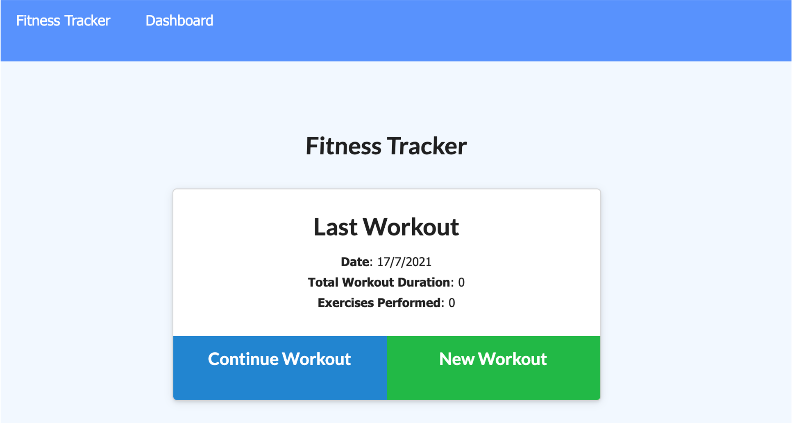

# Fitness-tracker

## Description

You will be able to view, create and track daily workouts. It is possible to log multiple exercises in a workout on a given day. Tracking includes name, type, weight, sets, repetitions, duration, and distance depending of the type of exercise. The weekly dasboard will display summary graphics of all workouts done. 

## Table of Contents

* [Installation](#installation)
* [Usage](#usage)
* [Screenshots](#screenshots)
* [Credits](#credits)
* [License](#license)

## Installation

For usage and be able to display functionality:

1. Clone the repository: https://github.com/sandraileana/Fitness-tracker.git
2. Open the terminal and "npm install" followed by "npm start" or "node server.js"
3. Open localhost on terminal 3000

## Usage

After this the user will be able to:

  * Add exercises to the most recent workout plan.

  * Add new exercises to a new workout plan.

  * View the combined weight of multiple exercises from the past seven workouts on the `Dashboard` page.

  * View the total duration of each workout from the past seven workouts on the `Dashboard` page.

## Screenshots

1. Fitness Tracker Homepage

2. Selecting type of excercise

3. Adding or completing your excercise

4. Last workout done

5. Dashboard

## Credits

### Author

* Sandra Pérez
* [Github](https://github.com/sandraileana)

## License

 

    

